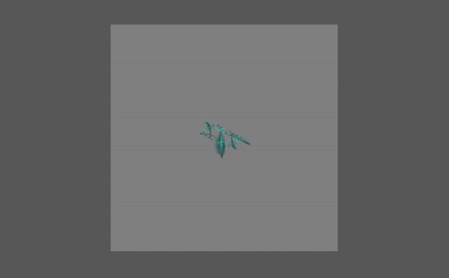

# Pavlovian Aversive Learning (PAL) task

**Build 1.1 16/08/2025**

Created by Michael Colwell (michael.colwell@psych.ox.ac.uk / michaelcolwell92@gmail.com ORCID 0000-0001-7846-2879), 2025

## License: 
The task materials and preprocessing script are offered free of charge for researchers. 

**It is requested that researchers who publish work using these materials (task or preprocessing script) cite the below paper(s)/repo.**

(*Paper forthcoming*)

(*Repo forthcoming*)

## Task Description

The Pavlovian Aversive Learning (PAL) task is a binary choice Pavlovian learning task with fixed reversals. During the task, indivuduals must learn the fixed probability of stimulation associated with three types of images. 
Two of these images represent stable, or control, cues: a stable threat cue and a stable safe cue, where each have a reciporical probability of 75% or 25% of an electrical stimulation occuring. The third image is the reversal
cue, which shifts its probability of stimulation between the 75% and 25% at fixed points throughout the task. Throughout the task, individuals rate images on whether they believe it will result in a stimulation ('right') or 
no stimulation ('left'). Aspects of the task were inspired by previous work in the field including work by [`Zika et al.`](https://www.nature.com/articles/s41467-023-39825-3).

The task contains three task versions for repeated measurements, with three unique deterministic schedules (split into two halves). However, python code for a determinstic schedule generator (['Schedule_Gen.py](../Conditions/Schedule_Gen.py)) 
is provided in the 'Conditions' folder, if you require further schedules (e.g., for a within-subjects design). 

For current stimulation, the task is currently calibrated for the **DS8R Biphasic Constant Current Stimulator**. If you wish to use other devices, you are welcome to modify the code to allow this. We encourage repo branches for
such task modifications to allow broader use. We thank the [unofficial DS8R Python repo](https://github.com/CCS-Lab/DS8R_python) for providing some scripts integrated here.

The task includes a stimulation sequences at the beginning and midway (~60%) throughout the task session. The task calibrates in steps of 10mA to determine the individual tolerance threshold (80%), and will reset
to the minimal stimulation if a stimulation exceeds the 80% tolerance threshold. The calibration will **not** continue into the task proper unless a stimulation mA is rating 80% three times consecutively. You can disable this logic at experimental startup.

The task has been designed with pupilometry in mind, with specific optimisations for minimal deviation from the centre fixation point for stimuli presentation. However, the task can be used without a pupilometry capable device. The main task repo does not contain code for pylink/pupilometry communication, however there is a task branch containing a task version for EyeLink 1000 Plus devices.

Processing and computational modelling scripts (including model validation reports) will be provided at a later update to the repo. 

This task is currently in-use in the Psychopharmacology and Emotion Laboratory (PERL) at the Department of Psychiatry, University of Oxford. 

## Instructions:

*Basics*
1. Download Psychopy (version 2024.1.5 and above) - https://www.psychopy.org/download.html
2. Once installed, unzip the contents of this folder to a location on your computer
3. Open the 'PAL task'  folder and double click on 'PAL_Task.psyexp'
4. Make sure the stimulation equipment (DS8R) is armed for USB communication.
5. Click 'run' experiment and follow onscreen instructions
6. Once the experiment has ended, you will find your test data in the 'data' folder.

For any additional help, I would be more than happy to answer questions (michael.colwell@psych.ox.ac.uk / michaelcolwell92@gmail.com)

**Thank you for reading!**

------------------------------------------
